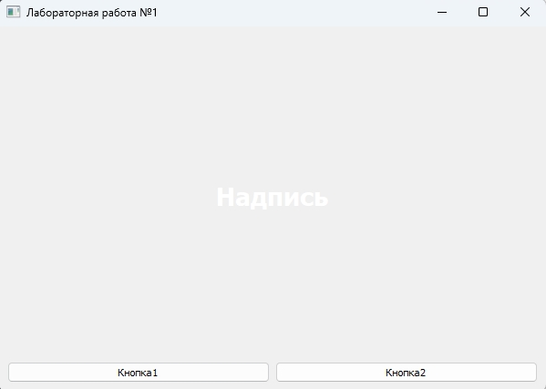
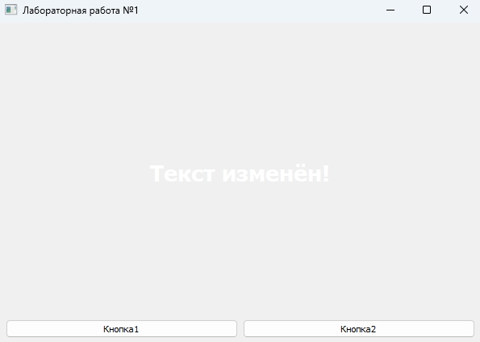
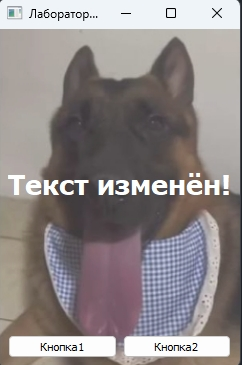
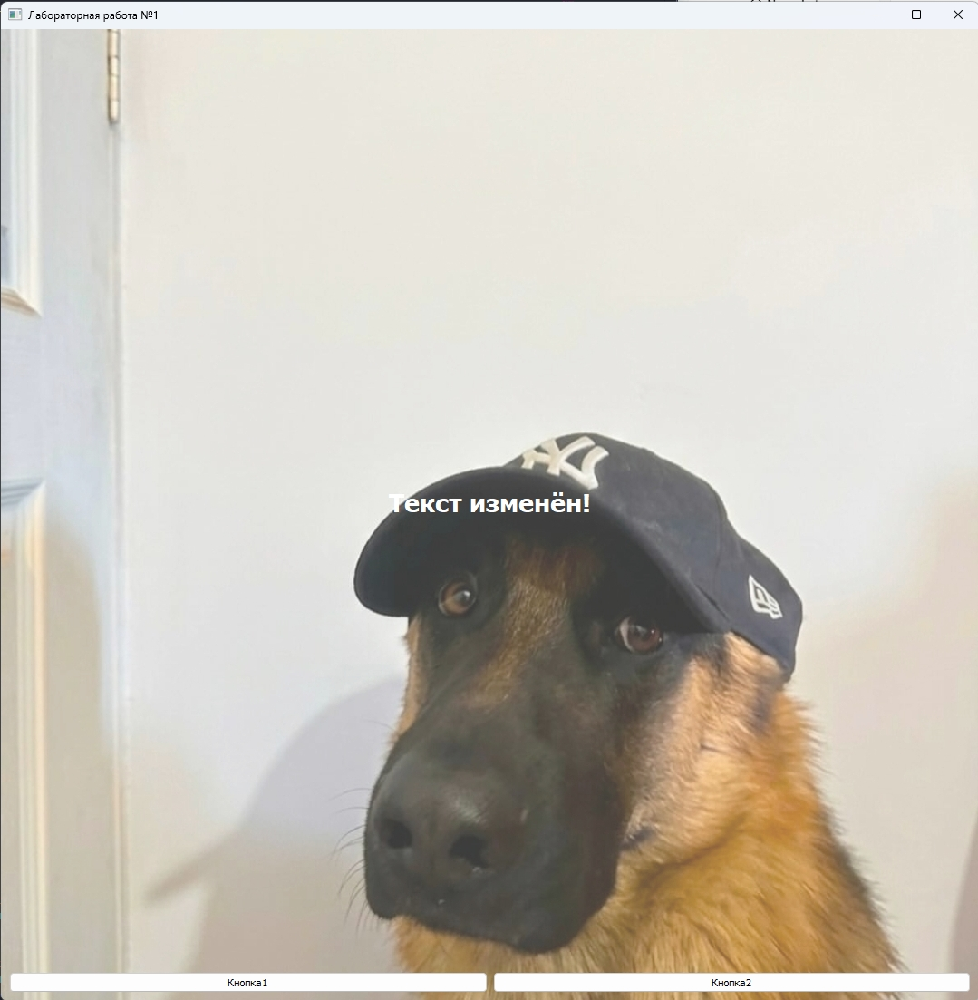

# Лабораторная работа №1

**Выполнила:** *Некрасова Дарья Вадимовна*  
**Группа:** *6233-010402D*  

---

## Задание

 Сделать окно, кнопку и надпись. При нажатии кнопки надпись меняется на изображение.

---

## Описание работы

Функционал:

- Главное окно с заголовком «Лабораторная работа №1».
- Надпись (`QLabel`) по центру, крупная, белая, с прозрачным фоном.
- Две кнопки (`QPushButton`) внизу окна:
  - **Кнопка1** — переключает текст надписи между «Надпись» и «Текст изменён!».
  - **Кнопка2** — открывает `QFileDialog` для выбора PNG-изображения.
- Выбранное изображение отображается **фоном окна** с прозрачностью 75 %.
- Размер окна подстраивается под картинку:
  - меньше экрана -> окно сжимается под её размер;
  - больше экрана -> окно максимизируется.

---

## Требования

- Python 3.6+
- PyQt5

---

## Скриншоты

### 1. Начальное состояние окна

### 2. Результат нажатия «Кнопка1»

### 3. Загрузка небольшого изображения

### 4. Загрузка большого изображения
